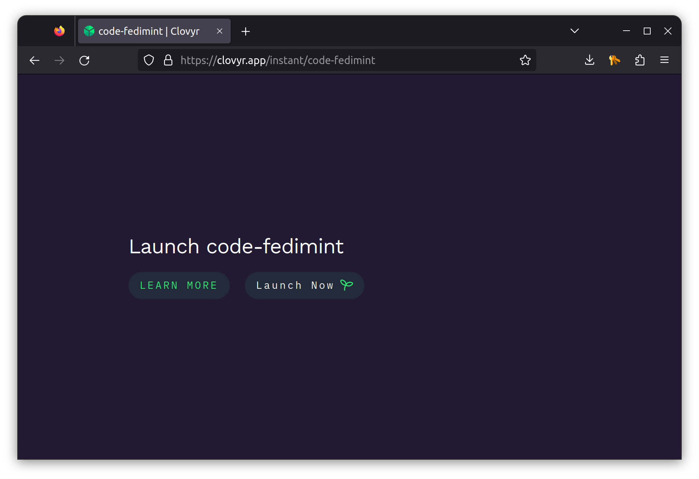

# Running Gateways

A fedimint lightning gateway is a service that bridges a fedimint community with the lightnigng network.

Esentially, a gateway is a [swap provider for federations](https://fedimint.org/docs/GettingStarted/TechCompontents#lightning-swaps).

In detail, a lightning gateway performs the following functions:

> - pay a lightning invoice on behalf of a user in a Federation
> - receive an incoming lightning payment on behalf of a user in a Federation.

From the perspective of the federation, the gateway is just a specialized federation client that registeres itself with the federation in order to serve the members of the fedimint community.


```rs
pub async fn register_with_federation(&self, config: LightningGateway) -Result<(){
 self.context
   .api
   .register_gateway(&config)
   .await
   .map_err(ClientError::MintApiError)
}
```

The gateway observes two [trust model assumptions in the federation](https://fedimint.org/docs/TradeOffs/Trust-Trade-Offs) as other fedimint clients
>  - **Custody**: A gateway must trust the Federation Guardians with custody of their funds which introduces custodial risk.
>    - limits the federations a gateway can serve
>    - limits liquidity a gateway can deploy in service to a federation
>  - **Tx Execution**: A gateway must trust the Federation Guardians to process transactions

A single gateway can serve any number of Fedimint federations.

Multiple gateways can serve the same federation. Open competition.

## Running Gateways in Clovyr

1. Visit **https://clovyr.app/instant/code-fedimint**


3. Launch Now in Clovyr


4. Change dir in launch shell
```sh
cd ~/git/fedimint
just fed-shell
```


> 

## Using the Gateways

**You have a running federation, some gateways connected to that federation, and a federation client**

- interact with the federation via cli

`fedimint-cli --help`

- check for the gateways connected to this federation

`fedimint-cli list-gateways`

- check initial balance for the fedimint client. note **total_amount** which is in msats

`fedimint-cli info` or `fedimint-cli info | grep total_amount`

**You can interact with the gateways through gateway-cli**

> since we have two gateways connected, we aliased two CLIs to call into each gateway we have
>
> - **gateway-lnd** - controls LND gateway connected to federarion
> - **gateway-cln** - controls CLN gateway connected to federarion
>
> **check the commands available on the gateway cli**
>
> `gateway-cln --help` or `gateway-lnd --help`
>
> **try locate federation id by using**
>
> `gateway-cln info` or `gateway-lnd info`

- check ecash balance of CLN gateway

`gateway-cln balance --federation-id <federation-id>`.

- check ecash balance of LND gateway

`gateway-lnd balance --federation-id <federation-id>`.

---

> **BONUS**
> 
> You can [run gateways in regular Fedimint Dev Environment](bonus/gateway-run.md) and you'll still be happy

## Making Lightning Payments

### Receive Payment through a Gateway

> A user inside a Fedimint federation creates a lightning invoice, to be paid by any client on the lightning network

1. Receive payment into federation through LND gateway

- create invoice from federation client

`fedimint-cli ln-invoice --amount 10000` and copy invoice

- pay invoice from CLN node

`lightning-cli pay <invoice`

> you can check updated fedimint client balance using `fedimint-cli fetch && fedimint-cli info`
> 
> **Now you try**...

2. Receive payment into federation through CLN gateway

- create invoice from federation client

`fedimint-cli ln-invoice --amount 10000`

- pay invoice from LND node

`lncli payinvoice <invoice>`

> you can check updated fedimint client balance using `fedimint-cli fetch && fedimint-cli info`

### Send Payment through a Gateway

> A client on the lghtning network creates a lightning invoice, to be paid by a user inside a Fedimint federation.

1. Send payment from the federation to external user through LND gateway

- create invoice from CLN node

`lightning-cli invoice 10000 "btc++" "fun description"` and copy invoice

- pay invoice from federation client

`fedimint-cli ln-pay <invoice>`.

> you can check status of invoice in CLN node using `lightning-cli`


> **Now you try**...

2. Send payment from the federation to external user through CLN gateway

> first, you would have to switch the gateway used by the federation client

run `use_cln_gw` or `fedimint-cli switch-gateway <cln-gateway-node-pubkey>` - you can get relevant node pubkey from `fedimint-cli list-gateways`

- create an invoice from LND node

`lncli addinvoice --amt_msat 100000` and copy invoice

- pay invoice from federation client

`fedimint-cli ln-pay <invoice>`

> you can check status of invoice in LND node using `lncli listinvoices` or lookup with invoice **r-hash** from earlier `lncli lookupinvoice <r-hash>`

---

> **HACKS**
> 
> Having truble copy pasting within the mprox / tmux shell? Use fedimint CLIs from within a plain shell. Steps
> 
> - open a new terminal in clovyr vscode
> - `cd ~/git/fedimint`
> - `source .tmpenv && source ./scripts/aliases.sh && source ./scripts/lib.sh`
> - you can now run all fedimint cli commands here...
