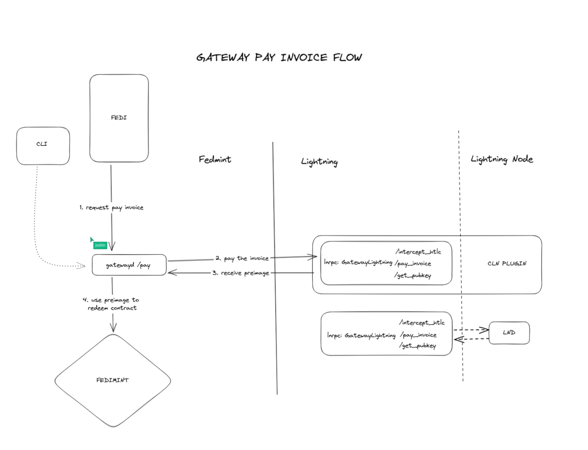
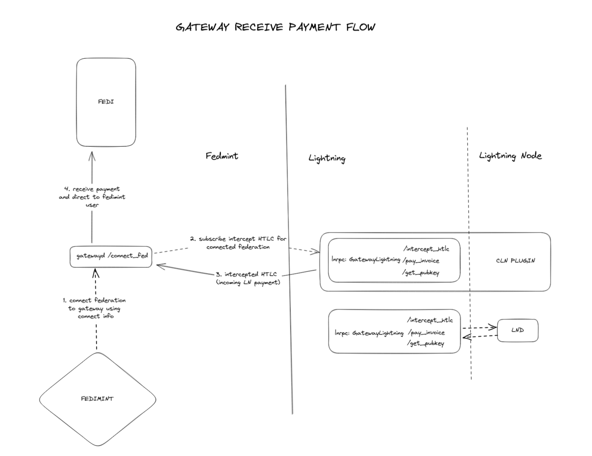
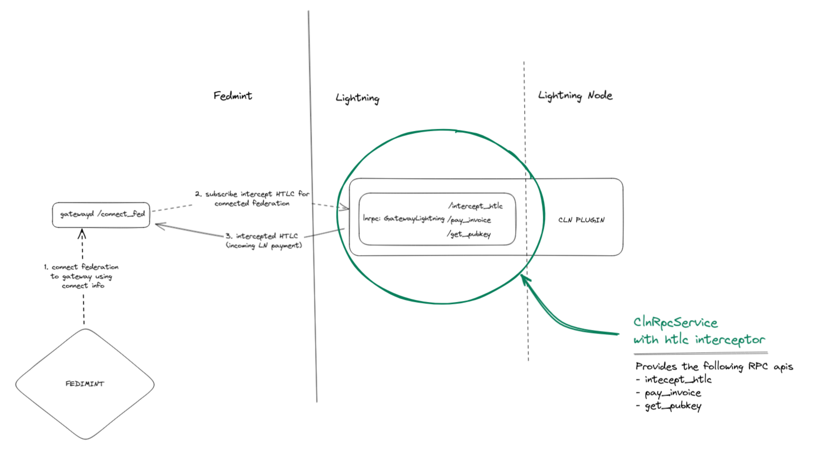
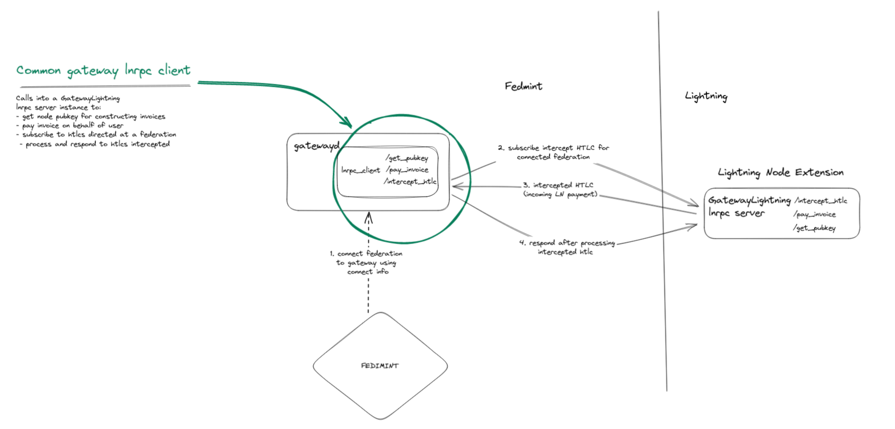
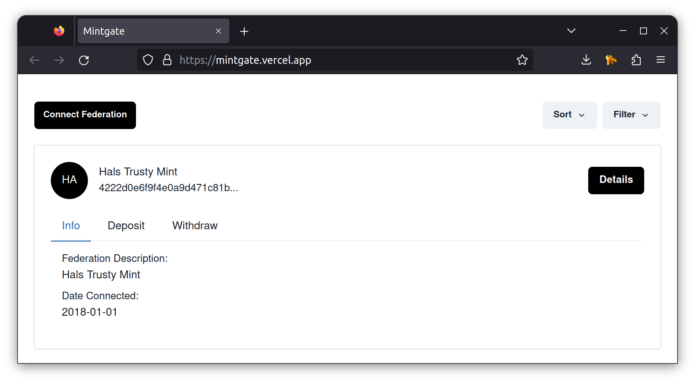

# Lightning Gateway Details

A gateway receives / sends lightning payments on behalf of users in a federation

1. **How send payment works**



2. **How receive payment works**




## Components of the Lightning Gateway

To perform it's function, we define and build the following functional/architectural components


### 1. Gateway Logic and Server (gatewayd)

Gateway business logic is packaged within a high-availability (always-on) service providing an API through which it can be requested to perform certain functions:

> - `/register-fed <federation-connection-info>`: Admin requests the gateway service to register to a federation and provide lightning swap service.
> - `/pay <federation-id> <contract-id>` : A client within the federation requests the gateway service to pay an invoice on it's behalf

> **Reference**:
> - See the full [gateway API definition](https://github.com/fedimint/fedimint/blob/7ef972e11b92018899e7e15eb6fc649a13801538/gateway/ln-gateway/src/rpc/rpc_server.rs#L31-L40) for other management APIs

### 2. Lightning Connector

Since the gateway needs to connect to any arbitrary Lightning implementation, we abstract the lightning network into a generic service interface named [`ILnRpcClient`](https://github.com/fedimint/fedimint/blob/15830ac51ac78311d8455a5b148aacce55ed0a8b/gateway/ln-gateway/src/lnrpc_client.rs#L24-L38).

```rs
#[async_trait]
pub trait ILnRpcClient: Debug + Send + Sync {
  /// Get the public key and alias of the lightning node
  async fn info(&self) -> Result<GetNodeInfoResponse>;

  /// Get route hints to the lightning node
  async fn routehints(&self) -> Result<GetRouteHintsResponse>;

  /// Attempt to pay an invoice using the lightning node
  async fn pay(&self, invoice: PayInvoiceRequest) -> Result<PayInvoiceResponse>;

  async fn route_htlcs<'a>(
      &mut self,
      events: ReceiverStream<RouteHtlcRequest>,
  ) -> Result<RouteHtlcStream<'a>>;
}
```

Per the interface definition, a gateway depends on the following actions on a lightning node
> - Source necessary node info from the lightning node. We currently need
>   - **node_pubkey**: for creating lightning contracts
>   - **node_alias**: for informational purposes
> - Get route hints from the gateway. These are useful for contructing invoices that include route hints for with higher guarantees of effectiveness
> - Pay invoice action: A gateway delegates pay invoice requests to nodes through this api
> - Route htlcs through the nore.
>   - The gateway subscribes to HTLCs routed through this connected node, intercepts some of those HTLCs and processes them on behalf of clients in a federation
>   - The gateway needs to submit the outcome after intercepting and processing such HTLC

> **References**:
> - See [an `ILnRpcClient` implementation that wraps LND gRPC API](https://github.com/fedimint/fedimint/blob/1cbe7ba986bf4679162b29607f47c68dcbb1dec4/gateway/ln-gateway/src/lnd.rs#L43)


In scenarios where we have to remotely interface with a lightning service, we
[defined a gRPC service](https://github.com/fedimint/fedimint/blob/master/gateway/ln-gateway/proto/gatewaylnrpc.proto) named `GatewayLightning` to which an `ILnRpcClient` can remotely call into.

```protobuf
service GatewayLightning {
  /* GetNodeInfo returns the public key and alias of the associated lightning node */
  rpc GetNodeInfo(EmptyRequest) returns (GetNodeInfoResponse) {}

  /* GetRouteHints returns the route hints to the associated lightning node */
  rpc GetRouteHints(EmptyRequest) returns (GetRouteHintsResponse) {}

  /* PayInvoice attempts to pay an invoice using the associated lightning node */
  rpc PayInvoice(PayInvoiceRequest) returns (PayInvoiceResponse) {}

  /* RouteHtlcs opens a stream for a client to receive specific
   * HTLCs that have a specific short channel id and receives a stream as input. 
   * For every HTLC intercepted and processed, the client can send a
   * CompleteHtlcsRequest over the input stream to complete the HTLC.
   *
   * Recommendation:
   * GatewayLightning implementations should respond with a channel stream
   * over which intercepted HTLCs are continually sent to the client.
   */
  rpc RouteHtlcs(stream RouteHtlcRequest) returns (stream RouteHtlcResponse) {}
}
```

With a standard gRPC definition, can implement the `GatewayLightning` spec for any existing or future Lightning node implementation.

> **References**:
> 
> - See a [`GatewayLightning` implementation packaged as a **CLN extension**](https://github.com/fedimint/fedimint/blob/1cbe7ba986bf4679162b29607f47c68dcbb1dec4/gateway/ln-gateway/src/bin/cln_extension.rs#L325)

> - See [an `ILnRpcClient` implementation that remotely calls into any generic `GatewayLightning` implementation like the **CLN extension**](https://github.com/fedimint/fedimint/blob/15830ac51ac78311d8455a5b148aacce55ed0a8b/gateway/ln-gateway/src/lnrpc_client.rs#L49-L78)



### 3. Fedimint Lightning Module

This module atomically and trustlessly executes contracts between a gateway client and other fedimint clients.

The module takes a LightningInput

```rs
pub struct LightningInput {
  /// Contract to update
  pub contract_id: contracts::ContractId,

  /// While for now we only support spending the entire contract we need to avoid
  pub amount: Amount,

  /// Of the three contract types only the outgoing one needs any other witness data than a signature.
  /// The signature is aggregated on the transaction level, so only the optional preimage remains.

  pub witness: Option<Preimage>,
}
```

And atomically produces a LightningOutput after fedimint consensus rounds.

```rs
pub enum LightningOutput {
  /// Fund contract
  Contract(ContractOutput),

  /// Create incoming contract offer
  Offer(contracts::incoming::IncomingContractOffer),

  /// Allow early refund of outgoing contract
  CancelOutgoing {
    /// Contract to update
    contract: ContractId,

    /// Signature of gateway
    gateway_signature: secp256k1::schnorr::Signature,
  },
}
```

> **References**:
> 
> - We cover some more detail about relevant Fedimint contracts in [this next section](02-contracts.md)
> 
> - Please reference Justin Moon's workshop on **Building Fedimint Modules**

### 4. Gateway Interfaces : CLI / Admin UI


> https://mintgate.vercel.app
