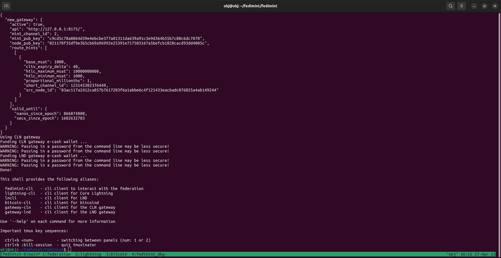
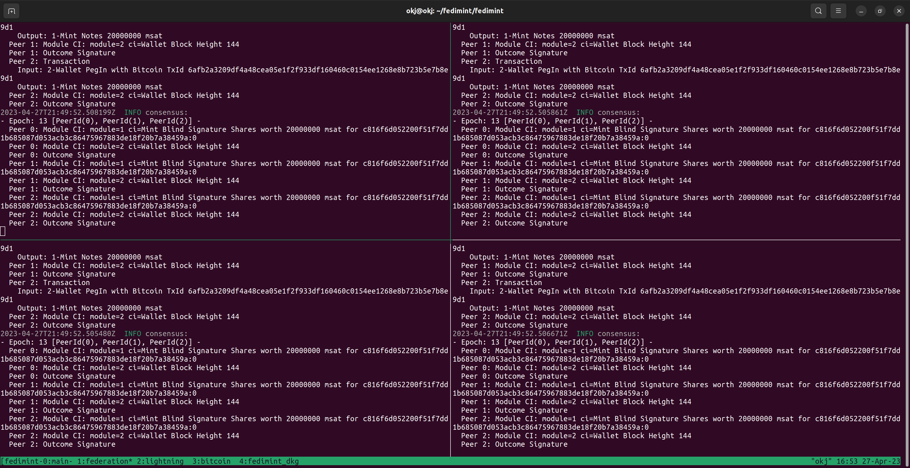
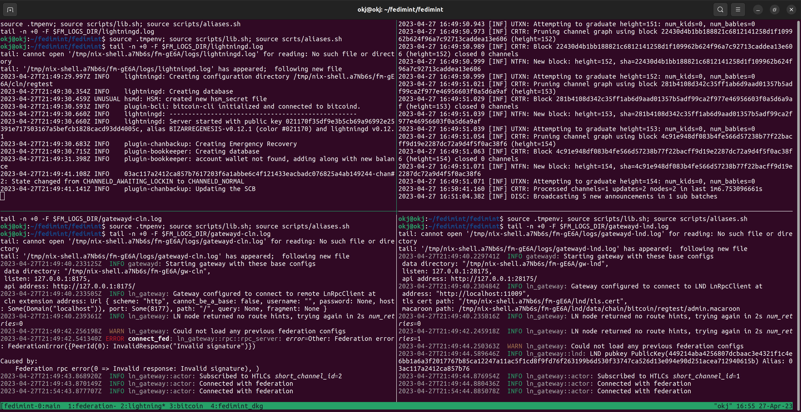

## Running Gateways in regular Fedimint Dev Environment (optional)
1. Setup [fedimint developer environment](https://github.com/fedimint/fedimint/blob/master/docs/dev-env.md)
2. Run [fedimint and gateways in the dev env](https://github.com/fedimint/fedimint/blob/master/docs/dev-running.md)

> Fedimint User shell

> Federation shell

> Gateway shell

**hacks**
Having truble copy pasting within the mprox / tmux shell? use clis from a plain bash shell. Steps
- open a new terminal in clovyr vscode
- `cd ~/git/fedimint`
- `source .tmpenv && source ./scripts/aliases.sh`
- you can now run all fedimint cli commands here...
